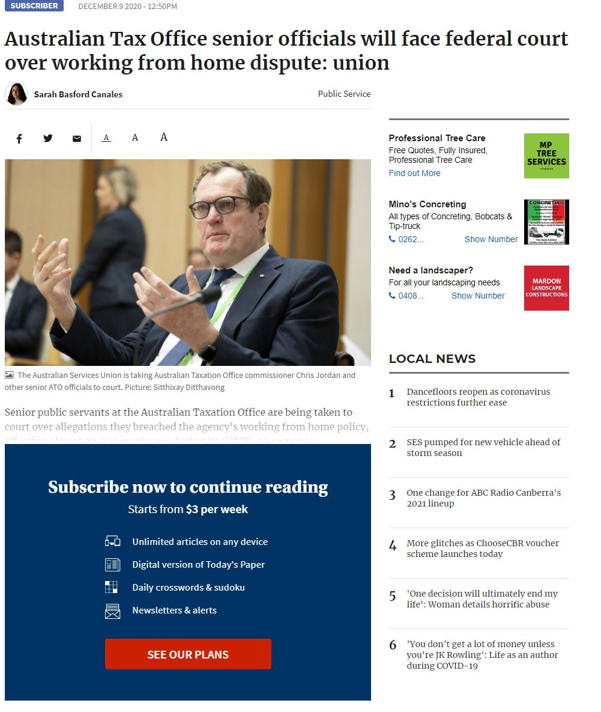

```{r setup, include=FALSE}
knitr::opts_chunk$set(echo = TRUE)
```

The purpose of this post is to show how to read subscriber articles from the [Canberra Times](https://www.canberratimes.com.au). Currently if you're not a subscriber you'll be given a paywall and will not be able to read the article. For [example](https://www.canberratimes.com.au/story/7047552/tax-office-heads-taken-to-court-over-working-from-home-dispute/?cs=14263):

{width="337"}

However, if you look into the source code, the whole article is there! We will now show how to access the article body.

```{r}
library(rvest)
library(stringr)
```

```{r, results='asis'}
url <- 'https://www.canberratimes.com.au/story/7047552/tax-office-heads-taken-to-court-over-working-from-home-dispute/?cs=14263'
article <- read_html(url)

# The article is always under: 
# <div itemprop="articleBody", class="hidden" aria-hidden="true">
article_body <- article %>% 
  html_nodes(".hidden") %>% 
  .[2] %>%  # we're only interested in the second one itemprop="articleBody"
  html_text() %>% 
  print()
```

<br>

And that's it, you can now read the hidden article behind the paywall!
